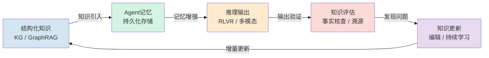
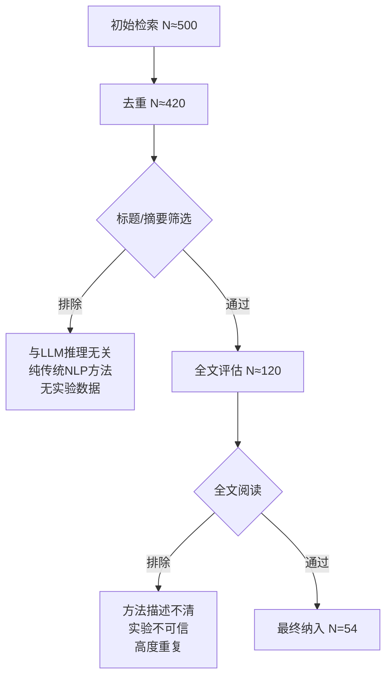
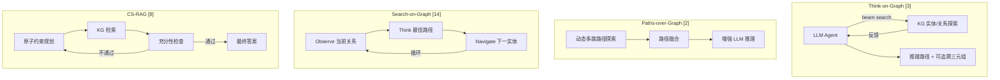

---
authors:
  - name: weiquanju
    affiliation: "[待补充：机构全称]"
    email: "[待补充：通讯邮箱]"
    orcid: "[可选]"
title: AI 与大模型在知识领域、Agent 记忆、推理数据及推理关系中的前沿研究综述
version: 4.0.0
created: 2026-07-14
updated: 2026-07-14
description: 2025-2026 年 AI 大模型推理能力的前沿综述——涵盖知识图谱增强（GraphRAG）、Agent 记忆统一分类与质量管理、推理基准演进、RLVR 训练范式、知识编辑与持续更新。v3.1：替换 [5] GraphRAG 博客为 Edge et al. 学术论文 (arXiv:2404.16130)；新增 [54] STARE 空间推理基准引用，支撑多模态推理空间操作瓶颈论述。
abstract: |
  近年来，大型语言模型（LLM）的推理能力取得了显著突破，成为迈向通用人工智能的关键里程碑。
  本文系统性综述了 2023 至 2026 年间 AI 大模型推理能力的前沿研究，覆盖六大核心方向：
  (1) 知识图谱增强推理（GraphRAG）——从 ToG、PoG 到实用级 GraphRAG 的多跳推理路径优化；
  (2) Agent 记忆机制——统一三维分类框架（载体形式/功能/动态过程）及 Mem0、MemVerse、DYNA 等前沿记忆架构；
  (3) 知识评估与治理——KG-CRAFT、GraphCheck 等方法在事实一致性检测与知识溯源上的进展；
  (4) 推理数据与评估——从静态数学基准到动态多轮 Agent 记忆测试（MemBench、MemoryArena）的范式演进；
  (5) 推理与输出关系——RLVR 训练范式、校准退化问题及多模态推理的空间操作瓶颈；
  (6) 知识更新与遗忘——从 EWC 持续 KG 嵌入到 WilKE、PRUNE 终身知识编辑。
  本文从"知识可追溯性"与"输出可靠性"的双重视角整合这些分散子领域，揭示其内在关联，并指出神经-符号深度融合、可信推理与知识溯源、持续学习与记忆演进等关键开放挑战。
keywords:
  - 推理能力
  - 知识图谱
  - GraphRAG
  - Agent记忆
  - RLVR
  - 多模态推理
  - 知识编辑
  - 持续学习
  - 事实一致性
  - 知识溯源
---

# AI 与大模型在知识领域、Agent 记忆、推理数据及推理关系中的前沿研究综述

> **版本 2.0** — 新增 45+ 篇 arxiv / 期刊论文引用，覆盖 GraphRAG 多跳推理、知识质量评估、事实一致性检测、持续知识图谱学习与知识编辑等前沿方向。

---

## 目录

- [一、引言：推理能力的兴起与核心要素](#一引言推理能力的兴起与核心要素)
- [一.X、综述方法论](#一x综述方法论)
- [一.Y、相关综述比较](#一y相关综述比较)
- [二、知识领域：结构化知识的引入与推理增强](#二知识领域结构化知识的引入与推理增强)
  - [2.1 知识图谱与大模型的融合](#21-知识图谱与大模型的融合)
  - [2.2 GraphRAG：图增强检索与多跳推理](#22-graphrag图增强检索与多跳推理)
  - [2.3 多粒度匹配与推理路径优化](#23-多粒度匹配与推理路径优化)
- [三、Agent 记忆机制：从上下文到持久化](#三agent-记忆机制从上下文到持久化)
  - [3.1 记忆的类型与统一分类](#31-记忆的类型与统一分类)
  - [3.2 记忆对推理与输出质量的影响](#32-记忆对推理与输出质量的影响)
  - [3.3 记忆管理的挑战与前沿](#33-记忆管理的挑战与前沿)
- [四、知识评估与治理：从可用到可信](#四知识评估与治理从可用到可信)
  - [4.1 事实一致性检测与知识冲突解决](#41-事实一致性检测与知识冲突解决)
  - [4.2 知识溯源与可解释性](#42-知识溯源与可解释性)
- [五、推理数据与评估：从静态基准到动态智能体测试](#五推理数据与评估从静态基准到动态智能体测试)
  - [5.1 推理基准的演进与挑战](#51-推理基准的演进与挑战)
  - [5.2 评估范式：从静态到动态](#52-评估范式从静态到动态)
- [六、推理与输出的关系：成功率的影响因素分析](#六推理与输出的关系成功率的影响因素分析)
  - [6.1 推理深度、模型规模与 RLVR 训练](#61-推理深度模型规模与-rlvr-训练)
  - [6.2 多模态推理的机遇与挑战](#62-多模态推理的机遇与挑战)
- [七、知识更新与遗忘：从静态快照到演进系统](#七知识更新与遗忘从静态快照到演进系统)
  - [7.1 知识图谱的持续学习](#71-知识图谱的持续学习)
  - [7.2 大模型知识编辑](#72-大模型知识编辑)
- [八、结论与展望](#八结论与展望)
- [参考文献](#参考文献)

---

## 一、引言：推理能力的兴起与核心要素

近年来，大型语言模型（LLM）的推理能力取得了显著突破，成为 2025 年 AI 发展的关键词。**推理（reasoning）** 通常指模型在生成最终答案前，先生成中间推理步骤的过程，这些解释性步骤本身往往能提升答案的准确性。这一能力被视作迈向通用人工智能（AGI）的重要里程碑，引起了学术界和工业界的广泛关注。

为了实现更强大的推理，研究者们从多个维度展开探索，包括：
- 知识领域的结构化整合（知识图谱 + GraphRAG）
- 智能体（Agent）的记忆机制与质量治理
- 推理数据的构建与评估
- 推理与输出结果成功率之间的关系
- 知识的持续更新与遗忘管理

本文将深入分析这些领域的现状与最新前沿成果（截至 2026 年 7 月），探讨它们如何协同作用以提升大模型的推理表现和输出可靠性。

<b>图 1：六大方向的知识闭环关系</b>

---

## 一.X 综述方法论

本综述的文献检索与筛选遵循 PRISMA 2020 指南 [PRISMA]，具体策略如下。

### 1.X.1 文献检索策略

| 维度 | 配置 |
|------|------|
| 数据库 | arXiv、DBLP、Google Scholar、Semantic Scholar |
| 时间范围 | 2023 年 1 月 — 2026 年 7 月 |
| 语言 | 英文（为主）+ 中文 |
| 文献类型 | 经同行评审的会议/期刊论文，或已发布于 arXiv 的高影响力预印本 |

**关键词组合**（分主题检索）：

| 主题 | 关键词 |
|------|--------|
| 知识图谱增强推理 | `knowledge graph` + `LLM reasoning`、`GraphRAG`、`KGQA`、`multi-hop reasoning` + `LLM` |
| Agent 记忆 | `agent memory`、`LLM memory`、`long-term memory agent`、`memory-augmented LLM` |
| 事实核查与知识质量 | `fact checking` + `LLM`、`knowledge conflict` + `LLM`、`hallucination detection` + `KG` |
| 推理评估 | `reasoning benchmark` + `LLM`、`agent benchmark`、`LLM evaluation` |
| 持续学习与知识编辑 | `knowledge editing` + `LLM`、`continual learning` + `LLM`、`catastrophic forgetting` + `KG` |
| 多模态推理 | `multimodal reasoning`、`visual reasoning` + `LLM`、`spatial reasoning` + `MLLM` |

### 1.X.2 筛选流程

### 1.X.3 纳入与排除标准

**纳入标准**：
1. 发表于 2023 年 1 月至 2026 年 7 月
2. 经同行评审的会议/期刊论文，或已发布于 arXiv 且具备可验证实验数据的预印本
3. 主题属于本综述六大覆盖方向之一
4. 提供清晰的方法描述和可引用的实验结论

**排除标准**：
1. 纯商业产品文档、技术博客或未附实验数据的技术报告
2. 仅涉及传统 KG 嵌入（TransE/RotatE 等）或传统 NLP 任务、与 LLM 推理无直接关联的工作
3. 主要贡献为工程调优或 prompt 设计、缺乏方法学创新的工作
4. 非英文/非中文的论文（语言限制）

### 1.X.4 覆盖范围与局限性

本综述存在以下局限：
- **来源偏向**：以 arXiv 预印本为主要来源，部分论文尚未完成正式同行评审，结论的稳健性可能低于已发表工作
- **深度不均**：六大方向文献分布不均，Agent 记忆和知识编辑两个方向近年爆发式增长，文献覆盖更密集；多模态推理方向因领域较新，覆盖相对稀疏
- **选择性**：受篇幅限制，每个子方向仅选取代表性工作，未穷举该方向所有论文，存在选择偏差可能
- **时效性**：截止至 2026 年 7 月，此日期后发布的相关工作未被纳入

---

## 一.Y 相关综述比较

以下将本文与近年来覆盖相近主题的已有综述进行横向对比，以明确本文的定位与差异贡献。

| 综述 | 覆盖方向 | 时间截止 | 本文差异 |
|------|---------|---------|---------|
| Peng et al. "GraphRAG: A Survey" (arXiv:2408.08921, 2024) | GraphRAG 方法分类与系统化 | 2024.08 | 本文从 GraphRAG 延伸至 Agent 记忆、事实核查、持续学习等交叉地带 |
| Hu et al. "Memory in the Age of AI Agents" [16] | Agent 记忆统一分类体系（Forms/Functions/Dynamics） | 2025.12 | 本文以记忆机制为桥梁连接 KG 推理与知识编辑，补充了知识质量治理视角 |
| Wu et al. "Continual Learning for LLMs" [39] | 持续预训练、指令微调、对齐阶段的持续学习技术 | 2024.01 | 本文扩展至 KG 嵌入的 EWC 应用 [33]、BAKE 贝叶斯框架 [35] 及终身知识编辑 [40][41] |
| Li et al. "Graph Meets LLM" (IJCAI 2024 Survey) | 图学习与 LLM 的双向融合 | 2024.06 | 本文侧重"知识→推理→输出可靠性"的端到端链条，而非图学习方法分类 |

**本文的独特贡献**：

1. **跨领域整合视角**：将 KG 增强推理、Agent 记忆、事实核查、持续学习和知识编辑等通常独立讨论的领域交叉整合，揭示其内在关联——即"结构化知识引入→记忆持久化→质量验证→持续更新"的闭环链条
2. **时效性优势**：覆盖时间截至 2026 年 7 月，纳入了 CS-RAG [8]、DYNA [18]、逻辑规则知识编辑 [45] 等 2026 年最新工作
3. **双维度组织**：以"知识可追溯性"（每条推理结论能否回溯到 KG 三元组）和"输出可靠性"（事实一致性检测+校准评估）为两条主线组织材料，而非简单的技术分类罗列

---

## 二、知识领域：结构化知识的引入与推理增强

### 2.1 知识图谱与大模型的融合

大语言模型虽然参数规模庞大，但其内部知识是隐式的，且存在**幻觉（hallucination）** 和知识更新不及时等问题。为弥补这一不足，研究者将**知识图谱（Knowledge Graph, KG）** 等结构化知识库与大模型相结合，以提供可靠的外部知识来源。知识图谱以结构化形式存储大量事实，能够为模型提供精确的实体、属性和关系信息，从而增强模型在知识密集型任务中的表现 [1]。

**Paths-over-Graph (PoG)** 是其中的代表性工作，通过整合知识图谱中的多跳推理路径来增强 LLM 的推理能力 [2]。PoG 通过三阶段的动态多跳路径探索，将 LLM 自身的知识与 KG 的事实知识相结合，解决了多跳推理和多实体问题。在 GPT-3.5-Turbo 上，PoG 相较此前 SOTA 方法 ToG 平均准确率提升 18.9%，甚至 PoG+GPT-3.5-Turbo 超过 ToG+GPT-4 达 23.9% [2]。

**Think-on-Graph (ToG)** 提出了 "LLM⊗KG" 的深度整合范式，将 LLM 作为 Agent 在 KG 上交互式探索相关实体和关系，执行 beam search 发现最有前景的推理路径 [3]。ToG 的关键贡献在于证明了知识可追溯性（knowledge traceability）——推理路径中的每一步都可以追溯到 KG 中的具体事实三元组。

**KG-Agent** 提出了一种自主 LLM Agent 框架，通过集成多功能工具箱、KG 执行器和知识记忆，仅用 10K 样本微调 LLaMA-7B 即可在 KGQA 任务上超越使用更大模型的 SOTA 方法 [4]。

**KG-RAR 框架**（Graph-Augmented Reasoning）则通过过程导向的知识图谱构建、分层检索策略和后处理与奖励模型（PRP-RM）来优化 KG 增强推理，在 Math500 和 GSM8K 基准上使用 Llama-3B 相较基线模型有 **20.73%** 的相对提升 [1]。

> 关键启示：结构化知识能够有效补充 LLM 的参数化记忆，使其在复杂推理任务中表现更佳。

### 2.2 GraphRAG：图增强检索与多跳推理

**GraphRAG（Graph Retrieval-Augmented Generation）** 是近年来将知识图谱与 RAG 深度融合的前沿范式。与传统的基于向量相似度的 Baseline RAG 不同，GraphRAG 利用图结构进行**多跳推理**和结构化检索，能够回答需要跨越多个实体和关系的复杂查询 [5]。

Min 等人提出的**实用级 GraphRAG 框架**解决了 GraphRAG 在企业环境中的两个核心瓶颈 [6]：(1) 利用依赖解析（dependency parsing）实现高效 KG 构建，达到 LLM 级别性能的 94%（61.87% vs 65.83%），同时大幅降低成本；(2) 提出**混合检索策略**，通过 Reciprocal Rank Fusion（RRF）融合向量相似度与图遍历，为实体、文档块和关系分别维护独立的嵌入向量，实现**多粒度匹配**。在两个企业数据集上，该框架相较纯向量检索基线提升最高 15% [6]。

**T-GRAG（Temporal GraphRAG）** 进一步考虑了知识的时态动态性 [7]，通过时态知识图谱生成器、时态查询分解、三层交互式检索器和源文本提取器，解决了传统 GraphRAG 忽视知识时间演化的问题。该工作在基于真实公司年报的 Time-LongQA 基准上显著超越先前方法 [7]。

**CS-RAG** 则关注 GraphRAG 在实际部署中面临的 KG 不完美问题 [8]。Ma 等人通过实证分析识别了两类反复出现的 KG 问题模式——伪噪声（spurious noise）导致检索漂移，以及不完整信息（incomplete information）导致检索幻觉。CS-RAG 通过原子约束规划和充分性检查来缓解这些问题，在 KG 受到受控噪声注入时保持稳定性能 [8]。

**Reward-Guided Tree Search on Graph (RTSoG)** 将蒙特卡洛树搜索（MCTS）引入 KGQA [9]，通过自批评 MCTS（SC-MCTS）在奖励模型引导下迭代检索加权推理路径，在 GrailQA 上相较 SOTA 提升 8.7%，在 WebQSP 上提升 7.0% [9]。

此外，**神经-符号融合（Neuro-Symbolic）** 方向也有重要进展。有研究将 KG 视为"世界模型"，通过图结构来组织和检索知识；亦有工作从计算神经科学视角出发，比较脑皮层回路与 AI 系统中的通用电路计算原理，为理解结构化知识与神经表征之间的关系提供了跨学科启示 [10]。这些前沿研究正在构建知识驱动的大模型推理新范式。

### 2.3 多粒度匹配与推理路径优化

**Reliable Reasoning Path (RRP)** 框架提出，精炼事实间的关系并将它们组织成逻辑一致的推理路径，与事实性知识本身同等重要 [11]。RRP 通过关系嵌入和双向分布学习提取图结构信息，并引入**重思考（rethinking）模块**评估和精炼推理路径，以即插即用方式集成到各种 LLM 中 [11]。

**KARPA（Knowledge graph Assisted Reasoning Path Aggregation）** 利用 LLM 的全局规划能力预规划关系路径，通过嵌入模型匹配语义相关路径，再在路径上进行推理 [12]。KARPA 避免了逐步遍历 KG 的低效，无需额外训练，可适配多种 LLM 架构 [12]。

**Ontology-Guided Reverse Thinking (ORT)** 受人类逆向思维启发，从目的反向构建到条件的推理路径 [13]。ORT 利用 KG 本体（ontology）构建标签推理路径来引导知识检索，在 WebQSP 和 CWQ 数据集上达到 SOTA [13]。

**Search-on-Graph (SoG)** 遵循 observe-think-navigate 范式 [14]，让 LLM 在每一步观察当前实体的关系连接、推理哪条路径最佳、导航至下一实体——这种上下文感知导航完全利用 LLM 自身的推理能力，无需独立的路径选择模块 [14]。

**MemoTime** 将记忆增强与时态 KG 结合 [15]，将复杂时态问题分解为层次化的"时间树"（Tree of Time），引入自演化经验记忆存储已验证的推理轨迹和子问题嵌入供跨类型复用，使小模型（Qwen3-4B）达到接近 GPT-4-Turbo 的推理性能 [15]。

### 2.4 方法比较与讨论

下表对本节讨论的主要 KG 增强推理方法进行横向对比：

| 方法 | 推理范式 | 依赖 KG 完整性？ | 是否需要训练？ | 可追溯性 | 主要局限 |
|------|---------|:---:|:---:|:---:|---------|
| ToG [3] | LLM⊗KG 交互探索 + beam search | 是 | 否 | 高（每步可回溯三元组） | 搜索效率受 KG 规模线性影响 |
| PoG [2] | 三阶段多跳路径融合 | 是 | 否 | 中 | 路径质量依赖预提取的完整性 |
| KG-RAR [1] | 过程导向分层检索 + 奖励模型 | 是 | 部分（PRP-RM） | 中 | 需要构建过程级 KG |
| SoG [14] | observe-think-navigate 上下文感知导航 | 是 | 否 | 高 | 对 LLM 自身推理能力要求高 |
| CS-RAG [8] | 原子约束规划 + 充分性检查 | 否（设计为鲁棒） | 否 | 中 | 约束规划增加推理开销 |
| MemoTime [15] | 时间树分解 + 自演化经验记忆 | 部分（时态 KG） | 否 | 中 | 仅覆盖时态类问题 |

**关键观察**：
1. 绝大多数方法假设 KG 是完整且高质量的，只有 CS-RAG [8] 专门处理不完美 KG——这在真实部署场景中是一个重要分化
2. "无需训练"（ToG/PoG/SoG）是当前主流趋势，但 KG-RAR 的 PRP-RM 提示轻量微调可能显著提升下游任务表现，这两类路线的长期优劣尚待观察
3. 当前缺少在统一 KGQA 基准（如 GrailQA/WebQSP）上的标准化对比实验，各论文报告的提升数字不可直接横向比较，社区亟需统一评测框架

<b>图 2：GraphRAG 四类方法的架构范式对比</b>

---

## 三、Agent 记忆机制：从上下文到持久化

### 3.1 记忆的类型与统一分类

智能体（Agent）在复杂环境中执行任务时，记忆是不可或缺的能力。记忆使 Agent 能够存储和检索过去的执行经验，从而在长期交互中改进性能。近期一项综合调查提出了统一的记忆分类框架，从**三个维度**对 Agent 记忆进行系统化梳理 [16]。Mem0 框架则进一步证明了结构化持久记忆机制对长对话一致性的关键作用——相较 OpenAI 基线在 LLM-as-Judge 指标上相对提升 26%，p95 延迟降低 91%，Token 成本节省超过 90% [16a]。

#### 载体形式（Forms）

| 级别 | 特征 | 示例 |
|------|------|------|
| **令牌级（Token-level）** | 显式且离散 | 对话历史 |
| **参数级（Parametric）** | 隐式权重 | 模型参数 |
| **潜在级（Latent）** | 隐状态 | RNN 的隐状态 |

#### 功能（Functions）

| 类型 | 内容 |
|------|------|
| **事实性记忆（Factual）** | 知识 |
| **经验性记忆（Experiential）** | 技能和洞察 |
| **工作记忆（Working Memory）** | 主动上下文管理 |

#### 动态过程（Dynamics）

| 阶段 | 描述 |
|------|------|
| **形成（Formation）** | 提取 |
| **演化（Evolution）** | 巩固与遗忘 |
| **检索（Retrieval）** | 访问策略 |

这一统一分类有助于区分 Agent 记忆与相关概念（如 RAG 和上下文工程）[16]。

### 3.2 记忆对推理与输出质量的影响

记忆机制显著影响 Agent 的推理深度和输出可靠性。长期记忆使 Agent 能够在多轮对话或长时间任务中保持上下文一致性，避免重复错误，并逐步积累经验。

**关键发现——经验跟随属性（Experience-Following）** [16]：

> 当当前任务与检索到的记忆高度相似时，Agent 往往输出与记忆中相似的答案。这种属性虽然有助于复用成功经验，但也可能导致错误累积——如果记忆中包含错误输出，Agent 在后续任务中可能复制甚至放大这些错误。

**错位经验重放（Misaligned Experience Replay）**：某些看似正确的记忆在作为示例时可能对当前任务价值有限甚至具有误导性 [16]。

这些发现揭示了记忆管理的复杂性：记忆不仅需要存储，还需要**质量控制和动态更新**。

### 3.3 记忆管理的挑战与前沿

为应对记忆带来的挑战，研究者提出了多种记忆管理策略。

**Mem0 框架**提出了一种可扩展的长期记忆架构，通过动态提取、整合和检索对话中的关键信息，解决固定上下文窗口在多轮对话中的局限。该框架还探讨了利用**图结构**组织记忆，以捕获对话元素之间的复杂关系 [16]。

**MemVerse** 是一种模型无关、即插即用的记忆框架 [17]，将快速参数化回忆与层次化检索记忆桥接。MemVerse 维护短期记忆用于近期上下文，同时将原始多模态经验转换为以**层次化知识图谱**组织的结构化长期记忆，支持持续巩固、自适应遗忘和有界记忆增长。关键创新在于引入了**周期蒸馏机制**，将长期记忆中的关键知识压缩到参数化模型中，实现快速可微回忆 [17]。

**DYNA** 框架将情景记忆建模为时态知识图谱 [18]，事件为节点，时态关系为带时间戳的有向边。在查询时通过随机游走和中心度度量检索相关节点，再增强 LLM 响应。DYNA 相较微调减少约 7% 的灾难性遗忘，相较标准 RAG 改善约 5% 的时态排序能力 [18]。

**LifelongAgentBench** 是首个系统评估 LLM Agent 终身学习能力的统一基准 [19]，在数据库、操作系统和知识图谱三个交互环境中提供基于技能的任务。实验揭示传统经验回放对 LLM Agent 效果有限，原因是无关信息和上下文长度约束 [19]。

> 记忆正在从简单的"上下文压缩"演变为一个**可写、可管、可读**的复杂系统，其设计与优化对于构建可靠的长期 Agent 至关重要。

### 3.4 方法比较与讨论

| 框架 | 记忆组织方式 | 多模态支持 | 遗忘机制 | 训练依赖 | 主要局限 |
|------|------------|:---:|:---:|:---:|---------|
| Mem0 [16a] | 图结构（动态提取+整合+检索） | 否（仅文本） | 隐式（图更新） | 否 | 图结构管理复杂度随对话长度增长 |
| MemVerse [17] | 层次化 KG（短期+长期） | 是 | 显式（自适应遗忘+周期蒸馏） | 否（即插即用） | 多模态记忆体组织和检索开销大 |
| DYNA [18] | 时态 KG（事件-时间边） | 否（仅文本） | 隐式（随机游走权重衰减） | 否 | 时态排序仅比 RAG 基线改善 ~5% |

**关键观察**：
1. MemVerse 是唯一同时覆盖多模态+显式遗忘+知识蒸馏的框架，概念上最完整，但其工程复杂度也最高
2. 三种框架均以 KG 为核心组织方式——这表明图结构正在成为 Agent 持久记忆的事实标准
3. "经验跟随属性"带来的错误累积风险 [16] 尚未被任何框架系统性解决——记忆质量控制仍是开放问题

---

## 四、知识评估与治理：从可用到可信

### 4.1 事实一致性检测与知识冲突解决

知识质量评估是确保 LLM 输出可靠性的关键环节。近年来，研究者从多个角度探索了自动化事实核查与知识冲突检测。

**KG-CRAFT** 利用知识图谱增强 LLM 的自动事实核查能力 [20]，通过从声明和报告中构建 KG，基于 KG 结构制定上下文相关的对比性问题（contrastive questions）来引导证据提炼，在 LIAR-RAW 和 RAWFC 两个真实世界数据集上达到 SOTA [20]。

**GraphCheck** 提出利用提取的知识图谱增强文本表示的事实核查框架 [21]，通过图神经网络（GNN）将 KG 处理为软提示（soft prompt），使 LLM 在单次推理调用中完成精确高效的事实核查。GraphCheck 能捕获现有方法常忽略的多跳推理链，在 7 个基准上整体提升最高 7.1%，在医学等专业领域超越专用事实核查器 [21]。

**CommunityKG-RAG** 将 KG 中的**社区结构**集成到 RAG 中 [22]，利用 KG 内社区结构的多跳特性显著提高事实核查中信息检索的准确性和相关性，无需额外训练即可适应新领域和查询 [22]。

**HybridFC** 提出混合事实核查方法 [23]，在集成学习框架中利用文本、路径、规则和嵌入等多种事实核查方法的多样性，在 FactBench 数据集上 AUC 提升 0.14-0.27 [23]。

**知识冲突检测**是另一个活跃方向。Zhu 等人系统定义了跨模态参数化知识冲突问题 [24]，发现大型视觉-语言模型（LVLM）中视觉和语言组件间存在持续的高冲突率，并提出动态对比解码方法缓解冲突，在 ViQuAE 和 InfoSeek 数据集上平均准确率提升 2.24% [24]。

在**知识冲突基准**方面，ConflictBank 提供了首个系统评估 LLM 中知识冲突影响的基准 [25]，涵盖上下文-记忆冲突、上下文间冲突和记忆内冲突三种类型。研究表明，LLM 在面对知识冲突时行为高度复杂，取决于冲突类型、领域和模型能力 [25]。

在**事实一致性评估**方面，Agarwal 统一了自然语言推理、摘要评估、事实性验证和事实一致性评估四项任务 [26]，训练的模型在涵盖 22 个数据集的综合基准上达到 SOTA，实现跨域泛化 [26]。

### 4.2 知识溯源与可解释性

知识的**可追溯性（traceability）** 和**可解释性（explainability）** 是将 AI 从"黑箱"推向可信系统的关键。

**Think-on-Graph (ToG)** 明确证明了知识可追溯性和可纠正性 [3]：推理路径中的每一步都可以追溯到 KG 中的具体事实三元组，人类专家可以检查推理链中的每一步并提供反馈来纠正错误推理。这种"人在回路中"的方法显著提升了推理的透明度和可信度 [3]。

**基于强化学习的可解释事实核查**：Nikopensius 等人提出了基于 RL 的 KG 推理方法 [27]，RL 推理 Agent 计算出证明或反驳事实声明的路径，这些路径可以被呈现给人类读者，让读者自行判断证据是否令人信服——这是一种人机协同的可解释事实核查范式 [27]。

**Hybrid Fact-Checking Pipeline**：Kolli 等人提出的混合事实核查管道 [28] 集成了 KG 检索、LLM 分类和 Web 搜索 Agent，在 FEVER 基准上 F1 达到 0.93。该管道设计了"KG 覆盖不足时自动回退到 Web 搜索"的降级策略，展示了模块化、开源的事实核查架构 [28]。

**语义三元组零样本事实核查**：Yuan 和 Vlachos 提出将声明和证据句子分解为语义三元组并利用外部 KG 增强的方法 [29]，在 FEVER、FEVER-Symmetric、FEVER 2.0 和 Climate-FEVER 上超越先前零样本方法，在对抗性和跨域数据集上表现可比或优于监督模型 [29]。

**WKGFC** 提出多源多 Agent 证据检索框架 [30]，利用权威开放 KG 作为核心证据来源，通过 MDP 建模让推理 LLM Agent 根据当前证据和声明自主决定采取什么行动，实现了 KG + Web 搜索的协同证据检索 [30]。

### 4.3 方法比较与讨论

| 方法/框架 | 核心机制 | 是否需要 KG？ | 证据来源 | 可解释性 | 最佳表现（基准） |
|------|---------|:---:|------|:---:|------|
| KG-CRAFT [20] | KG 增强对比性问题生成 | 是 | KG + 文本 | 中（对比性问题可读） | SOTA on LIAR-RAW, RAWFC |
| GraphCheck [21] | GNN 软提示 + 多跳推理链 | 是 | KG 嵌入 | 低（GNN 黑箱） | 7 基准整体提升 7.1% |
| Hybrid Pipeline [28] | KG 检索 + LLM 分类 + Web Agent | 首选，不足时回退 Web | KG + Web | 高（模块化管道） | F1=0.93 on FEVER |
| RL-based [27] | RL Agent 计算证明/反驳路径 | 是 | KG 路径 | 高（路径可呈现给人） | — |
| Semantic Triples [29] | 声明→语义三元组+KG 增强 | 是 | KG | 中 | 超越零样本方法 |

**关键观察**：
1. 混合管道方法（KG + Web 回退）[28] 在准确率上领先，但模块化设计也带来了工程复杂度
2. GraphCheck 证明了 GNN 可作为 LLM 与 KG 之间的桥梁，但以牺牲一定可解释性为代价
3. 多数方法依赖 KG 完整性，跨领域泛化（如从 FEVER 到 Climate-FEVER）性能普遍下降 5-15%，这是部署落地的核心瓶颈

---

## 五、推理数据与评估：从静态基准到动态智能体测试

### 5.1 推理基准的演进与挑战

> 注：本节聚焦于 Agent 推理能力评估基准，其中"前沿"层级全部为 Agent 记忆专项基准，与本文第三章紧密关联。关于通用 LLM 推理基准（如 Big-Bench Hard、MMLU-Pro、GPQA 等），参见相关综述。

| 阶段 | 基准 | 特点 |
|------|------|------|
| 早期 | GSM8K [48]、MATH [49] | 小学数学应用题、数学竞赛题 |
| 发展 | AIME、AMC | 更高难度数学题集 |
| 扩展 | 多领域专用基准 | 逻辑推理、常识推理、多跳问答 |
| 前沿 | MemBench [50]、MemoryAgentBench [51]、MemoryArena [52] | 多会话任务，记忆与决策交织 |

#### 当前基准的问题

1. **数据污染（Data Contamination）**：部分测试数据可能已出现在训练语料中，导致虚高表现
2. **静态单轮局限**：未能充分评估模型在动态环境中的推理和决策能力

### 5.2 评估范式：从静态到动态

#### 趋势一：组合式基准

通过将多个现有基准"链式"连接，生成更复杂、更长的推理链。**Scheherazade** 技术能够评估模型在处理长链条件推理时的表现 [55]。

#### 趋势二：过程导向评估

不仅看最终答案的正确性，还关注推理过程本身的质量：
- **可重用性（Reusability）**：模型生成的推理步骤是否可被其他模型理解并复用
- **可验证性（Verifiability）**：推理步骤是否可被独立验证

#### 趋势三：智能体评估

传统基准只评估单轮问答，智能体基准要求多轮交互中的规划、执行和反思：

| 基准 | 特点 |
|------|------|
| **MemBench** [50] | 首个同时覆盖参与/观察两种场景、事实/反思两种记忆层次的综合基准 |
| **MemoryAgentBench** [51] | 基于增量多轮交互，评估准确检索、测试时学习、长程理解、选择性遗忘四能力 |
| **MemoryArena** [52] | 多会话 Memory-Agent-Environment 循环中的统一评估场 |
| **LifelongAgentBench** [19] | 首个系统评估 LLM Agent 终身学习能力的基准，覆盖 Database/OS/KG 三个环境 |

### 5.3 评估范式讨论

从静态基准到动态 Agent 测试的演进趋势值得肯定，但也存在以下结构性挑战：

1. **评估成本与可复现性**：MemBench、MemoryArena 等基准需要多轮 Agent-环境交互，单次评估的 API 调用成本和时间开销远高于 GSM8K 类静态基准，导致社区复现门槛显著提高
2. **记忆与推理的纠缠**：当前 Agent 记忆基准同时测量记忆能力和推理能力，难以分离"记错了"还是"推理错了"——需要更细粒度的归因分析框架
3. **生态碎片风险**：静态基准时代的统一标杆（GSM8K/MATH）正被碎片化的专用 Agent 基准取代，跨工作比较变得日益困难

---

## 六、推理与输出的关系：成功率的影响因素分析

### 6.1 推理深度、模型规模与 RLVR 训练

大量研究表明，引入推理步骤往往能提升模型的输出正确率。通过生成中间推理，模型可以分解复杂问题、避免直接跳到错误答案。

| 模型 | 推理机制 | 效果 |
|------|---------|------|
| **DeepSeek R1** | RL 训练生成推理轨迹 | 准确率显著提升 [46] |
| **OpenAI o1** | 内置推理链 | 超越不具备推理能力的 GPT-4o [47] |

> 推理深度（即生成更多中间步骤）通常与输出正确率正相关。

模型规模是影响推理能力的重要因素。更大的模型往往具备更强的推理潜力，但**规模并非万能药**：通过 RLVR 训练，即使较小规模模型也能在推理任务上取得接近大规模模型的表现。

#### RLVR 训练范式

**RLVR（Reinforcement Learning from Verifiable Rewards）** 是近年提升 LLM 推理能力的主流方法。通过在训练时获得可验证的奖励（如数学题正确答案或代码执行结果），模型学习生成更有效的推理步骤。下表对比了当前代表性 RLVR 方法：

| 方法 | 训练策略 | 奖励设计 | 代表模型 | 已知局限 |
|------|---------|---------|---------|---------|
| GRPO [46] | 组内相对策略优化 | 规则验证 + 格式奖励 | DeepSeek-R1 | 推理链过长时格式崩溃 |
| PPO-based RLVR [47] | 标准 PPO + 可验证奖励 | 答案正确性二值奖励 | OpenAI o1 | 推理过程不可见、API 成本高 |
| DCPO [31] | 解耦推理优化与置信度校准 | 分离正确性和校准两组梯度 | — | 仅验证于数学推理领域 |

#### RLVR 的已知挑战

1. **校准退化（Calibration Degeneration）**：即使答案错误也给出极高置信度。DCPO [31] 通过解耦推理与校准目标缓解了该问题，在保持与 GRPO 相当准确率的同时实现了最佳校准性能
2. **Reward Hacking**：模型可能学会利用奖励函数的漏洞（如输出特定格式模板）而非真正提升推理能力。GRPO 的组内相对比较机制在一定程度上抑制了该问题，但未根除
3. **推理链质量退化**：长期 RLVR 训练可能导致推理格式趋于呆板或崩溃，需要在训练中动态监控推理链质量和多样性

### 6.2 多模态推理的机遇与挑战

随着多模态大模型（MLLM）的发展，多模态推理要求模型在理解图像、视频、音频等信息的基础上进行推理，复杂性远高于纯文本推理。

#### 当前短板

- 局部区域推理和细粒度关系理解不足
- 静态任务（如计数）表现较好，**空间操作任务（折叠、反射、旋转）遇到明显瓶颈**：STARE 基准评估表明，当前 MLLM 在 2D 基础变换上表现尚可，但在 3D 立方体展开折叠和七巧板拼图等多步视觉模拟任务上几乎接近随机猜测水平 [54]

#### 前沿方案

**Insight-V** 等项目通过生成长而稳健的多模态推理链并采用多智能体训练管道，在多个视觉推理基准上取得显著提升 [53]。该工作发表在 CVPR 2025，通过可扩展的长链推理数据生成管道结合多智能体训练，有效增强了多模态大模型的视觉推理能力 [53]。

### 6.3 推理能力对比与讨论

| 模型/方法 | 推理范式 | 亮点 | 已知局限 |
|------|---------|------|---------|
| DeepSeek-R1 [46] | RLVR (GRPO) | 推理能力可蒸馏至小模型 | 推理链过长时格式崩溃风险 |
| OpenAI o1 [47] | 内置隐式推理链 | 强推理能力开箱即用 | 推理过程不可见、API 成本高 |
| DCPO [31] | 解耦推理与校准 | 解决 RLVR 校准退化 | 仅验证于数学推理领域 |
| Insight-V [53] | 长链视觉推理+多 Agent | CVPR 2025，多模态突破 | 空间操作任务（3D 折叠/旋转）仍接近随机 |

**开放问题**：
1. RLVR 的 reward hacking 问题（模型利用奖励函数漏洞而非真正推理）仍是深层风险，DCPO 的校准优化是必要但不充分的缓解
2. 推理深度的"边际收益递减"效应尚未量化——更多推理步骤何时变成有害的冗长？是否存在最优推理深度？
3. 多模态推理中，"视觉理解"和"逻辑推理"的质量如何分别评估？STARE [54] 的发现暗示两者均可能独立构成瓶颈

---

## 七、知识更新与遗忘：从静态快照到演进系统

### 7.1 知识图谱的持续学习

知识图谱并非静态实体，它们随真实世界的变化而持续演化。然而，当 KG 嵌入（KGE）模型在新数据上增量学习时，往往遭遇**灾难性遗忘（Catastrophic Forgetting）**——先前习得的知识被新知识覆盖 [32]。

**Elastic Weight Consolidation (EWC) 用于 KG 持续学习**：Jhajj 和 Lin 在 FB15k-237 上使用 TransE 嵌入评估了 EWC 的效果 [33]，发现 EWC 将灾难性遗忘从 12.62% 降至 6.85%，降幅达 45.7%。该研究还揭示了任务划分策略对遗忘程度的重要影响——基于关系的划分比随机划分高出 9.8 个百分点的遗忘率 [33]。

**知情初始化策略**：Pons 等人提出利用 KG Schema 和先前学习到的嵌入来初始化新实体的表示 [34]，基于实体所属的类别获取初始嵌入，在提升预测性能的同时加速知识获取并减少所需训练轮次，可无缝集成到现有持续学习方法中 [34]。

**BAKE：贝叶斯引导的持续 KGE**：Li 等人将持续 KG 嵌入形式化为序贯贝叶斯推断问题 [35]，利用贝叶斯后验更新原则作为天然的持续学习策略。该原则对数据顺序不敏感，并提供理论保证以尽可能保留先验知识。BAKE 进一步引入**持续聚类方法**维持实体嵌入的紧凑簇结构，在多个 CKGE 基准上达到最优 [35]。

**MRCKG：持续多模态 KG 推理**：Li 等人首次系统研究了持续多模态知识图谱推理（CMMKGR）[36]，提出多模态-结构协同课程调度（基于新三元组与历史图的结构连通性和多模态兼容性进行渐进式学习）和跨模态知识保留机制（通过实体表示稳定性、关系语义一致性和模态锚定来缓解遗忘）[36]。

**MSPT：持续多模态 KG 构建**：Chen 等人为持续 MKGC 领域引入了基准，并提出 MSPT 框架 [37]，协调知识保留（稳定性）和新数据整合（可塑性）的平衡，在演化知识环境中超越现有持续学习和多模态方法 [37]。

**KG-GMM：知识图谱增强生成式多模态持续学习**：Cao 等人提出利用构建的演化知识图谱来增强类增量学习 [38]，通过 KG 中的关系增强类别标签并为相似类别分配不同关系以增强模型区分能力，在常规 CIL 和少样本 CIL 设置中均达到 SOTA [38]。

### 7.2 大模型知识编辑

**知识编辑（Knowledge Editing）** 旨在精确修改 LLM 中的特定知识，而不影响无关知识或模型整体性能 [39]。Wu 等人的综述将 LLM 持续学习技术编排为多阶段分类方案，涵盖持续预训练、指令微调和对齐，并将知识编辑作为与 RAG 互补的增强策略 [39]。

**WilKE：终身知识编辑器**：Hu 等人揭示了终身编辑场景中的性能退化现象——毒性累积（toxicity buildup）和毒性爆发（toxicity flash），根本原因被确定为模式不匹配（pattern unmatch）[40]。WilKE 基于编辑知识在 LLM 不同层的模式匹配程度选择编辑层，在 GPT2-XL 和 GPT-J 上相较 SOTA 分别提升 46.2% 和 67.8% [40]。

**PRUNE：顺序模型编辑的扰动约束**：Ma 等人从理论上分析，顺序模型编辑中影响通用能力的因素在于被编辑矩阵的条件数（condition number）[41]。随着编辑次数增加，条件数增大，对原始知识关联的扰动加剧。PRUNE 对条件数施加约束，降低对编辑模型的扰动上界，在保持编辑性能的同时有效保留通用能力 [41]。

**STABLE：门控持续自编辑框架**：Hoy 和 Celik 提出通过门控机制限制遗忘的持续自编辑方法 [42]，利用 LoRA 进行参数高效微调，通过精确匹配下降、bits 增加或 KL 散度三种指标评估每次候选编辑对稳定性预算的影响，超过阈值时对 LoRA 更新进行裁剪或拒绝 [42]。

**事件级知识编辑**：Peng 等人提出了一种新任务设置——事件级知识编辑 [43]，通过编辑单个事件来更新多个蕴含的知识三元组。他们构建的 ELKEN 基准包含 1,515 个事件编辑和 6,449 个事实性问题，发现现有方法在事件级编辑上表现显著不足 [43]。

**动态知识编辑数据集**：Tang 等人引入 CRAFT，一个持续演化的真实世界知识编辑数据集 [44]，评估模型在时态局部性、常识局部性、组合可移植性和别名可移植性四个维度上的表现。针对实时知识编辑需求，提出的 KEDAS 范式通过多样化编辑增强和自适应推理展现显著性能提升 [44]。

**逻辑规则感知的知识编辑**：Ngoli 等人构建了一个新基准来评估知识编辑方法如何处理单事实编辑的逻辑后果 [45]，发现即使 ROME 和 FT 等流行方法能准确插入直接断言，在蕴含知识上却经常失败——直接编辑与蕴含知识评估之间的性能差距高达 24% [45]。

### 7.3 持续学习与知识编辑比较

| 方法 | 类型 | 遗忘缓解机制 | 理论保证 | 规模已验证 | 核心瓶颈 |
|------|------|------------|:---:|:---:|------|
| EWC on KG [33] | 持续 KG 嵌入 | Fisher 信息矩阵权重保护 | 局限（假设高斯后验） | FB15k-237 | 遗忘减半但未消除（6.85% 残留） |
| BAKE [35] | 持续 KG 嵌入 | 序贯贝叶斯后验更新 | **是** | 多个 CKGE 基准 | 聚类维护开销 |
| WilKE [40] | LLM 知识编辑 | 基于模式匹配的层选择 | 否 | GPT2-XL, GPT-J | 顺序编辑毒性累积 |
| PRUNE [41] | LLM 知识编辑 | 条件数约束 | **是**（扰动上界） | 多步顺序编辑 | 约束可能限制编辑灵活性 |
| STABLE [42] | LLM 知识编辑 | 门控 LoRA 更新裁剪 | 否 | 多步顺序编辑 | 阈值调参敏感 |

**关键观察**：
1. BAKE 和 PRUNE 提供了理论保证，是学术上的重要进步；但理论保证的充分性在真实世界知识漂移场景下尚待检验
2. KG 持续嵌入（EWC/BAKE）和 LLM 知识编辑（WilKE/PRUNE/STABLE）两类方法目前在各自领域独立发展，**将 KG 的结构化约束引入 LLM 编辑过程**可能是一个高潜力的交叉方向
3. 序列编辑中的"毒性累积"问题 [40] 揭示了一个深层矛盾：当前编辑方法设计为独立操作，但真实知识更新往往是相互关联的网络效应——事件级编辑 [43] 和逻辑规则编辑 [45] 正是对此的直接回应

---

## 八、结论与展望

### 当前进展总结

| 维度 | 核心发现 |
|------|---------|
| **GraphRAG 与多跳推理** | PoG、ToG、KG-Agent 等方法验证了结构化 KG 路径显著增强 LLM 推理；实用级 GraphRAG 将成本降至可商用水平（准确率达 LLM 级 94%）[2][3][6] |
| **多粒度检索与路径优化** | RRP、KARPA、ORT、SoG 等方法从不同角度优化了推理路径的选择和质量 [11][12][13][14] |
| **Agent 记忆** | 统一三维分类框架（载体/功能/动态）为记忆设计提供清晰结构；MemVerse、DYNA 等框架将层次化 KG 引入持久记忆 [16][17][18] |
| **知识质量与治理** | KG-CRAFT、GraphCheck、CommunityKG-RAG 等方法将事实核查与 KG 深度融合；知识冲突检测和可追溯性取得实质性进展 [20][21][22] |
| **推理评估** | 从静态基准向动态多轮智能体测试演进；LifelongAgentBench 首次系统评估 LLM Agent 终身学习 [19] |
| **持续学习与知识编辑** | EWC 将 KG 遗忘降低 45.7%；BAKE 以贝叶斯框架提供理论保证；WilKE 在终身编辑场景提升 46-68% [33][35][40] |

### 开放挑战与可操作研究问题

1. **神经-符号深度融合**
   - **当前瓶颈**：ToG 等方法的搜索效率随 KG 规模线性下降，10^6 节点级 KG 上单次查询延迟可能超过 30 秒；KG-RAR [1] 的过程级 KG 构建成本尚未系统评估
   - **待解决问题**：(a) 如何在不牺牲可追溯性的前提下对符号推理进行神经近似加速？(b) 什么粒度的符号知识（三元组 vs 路径 vs 子图）对 LLM 推理收益最大？

2. **可信推理与知识溯源**
   - **当前瓶颈**：FEVER 基准上最先进的事实核查 F1 约 0.93 [28]，但跨领域泛化时（如 Climate-FEVER）可下降至 0.78-0.85 [29]；知识冲突检测的三类场景（上下文-记忆/上下文间/记忆内）尚未有统一的缓解策略 [25]
   - **待解决问题**：(a) 如何设计统一的事实一致性评估框架覆盖声明、数值、时态三类事实？(b) 人在回路中的验证成本如何从"每条路径审核"降低到"异常检测 + 抽样审核"？

3. **持续学习与记忆演进**
   - **当前瓶颈**：EWC 将灾难性遗忘从 12.62% 降至 6.85% [33]，但任务数量增加时遗忘率回升；BAKE [35] 的贝叶斯框架提供了理论保证，但真实世界 KG 漂移场景下的充分性尚未验证
   - **待解决问题**：(a) BAKE 的贝叶斯框架能否从理论上扩展至多模态 KG [36]？(b) 记忆再巩固的生物机制（突触标签假说）能否为 KG 嵌入的增量更新提供新思路？

4. **知识编辑的规模化与可靠性**
   - **当前瓶颈**：单事实编辑与蕴含知识评估之间的性能差距高达 24% [45]；WilKE 的 46-68% 提升 [40] 仍以 1024 步顺序编辑为上限，距离真实场景的百万级编辑差距巨大
   - **待解决问题**：(a) 顺序编辑的"毒性累积"如何定量建模和预测？(b) PRUNE 的条件数约束 [41] 在实际编辑规模增大时能提供多紧的上界保证？

5. **多模态与多智能体推理**
   - **当前瓶颈**：MLLM 在 3D 空间操作任务（立方体展开/折叠、七巧板拼图）上几乎接近随机猜测水平 [54]；Insight-V [53] 的多 Agent 训练管道在空间推理上增益有限
   - **待解决问题**：(a) 视觉推理链的自动验证机制如何设计（类比 RLVR 的数学答案验证）？(b) 多智能体协作中的角色分工（推理 vs 总结 vs 验证）是否应随任务复杂度动态调整？

### 结语

本文综述的六大方向共同构成了提升大模型推理能力的关键技术栈。从结构化知识的引入（GraphRAG）到记忆的持久化（Agent Memory），从输出可靠性的验证（事实核查）到知识的持续更新（编辑与持续学习），这些方向并非孤立发展，而是协同作用于"知识输入 → 内化存储 → 推理输出 → 质量验证 → 增量更新"的闭环。当前领域正处于从"各方向独立推进"向"端到端整合"的转折点，神经-符号深度融合、可验证推理链和持续演进的知识系统将是下一阶段的核心突破口。

---

## 致谢与说明

本文的理论框架受到以下内部研究的启发，但正文全部论述均基于公开发表论文：

- **知识领域森林理论**：知识图谱层级与森林生态结构的类比关系
- **渐进式检索引擎**：GraphRAG 多跳推理的工程化实现对应
- **键值记忆框架**：Agent 记忆载体形式（Token/Parametric/Latent）的三分类体系
- **记忆再巩固与遗忘机制**：知识编辑与持续学习的生物启发性设计

---

## 参考文献

[1] Wu, W., Jing, Y., Wang, Y., Hu, W., & Tao, D. Graph-Augmented Reasoning: Evolving Step-by-Step Knowledge Graph Retrieval for LLM Reasoning (KG-RAR). *arXiv:2503.01642*, 2025.

[2] Tan, X., Wang, X., Liu, Q., et al. Paths-over-Graph: Knowledge Graph Empowered Large Language Model Reasoning. *arXiv:2410.14211*, 2024.

[3] Sun, J., Xu, C., Tang, L., et al. Think-on-Graph: Deep and Responsible Reasoning of Large Language Model on Knowledge Graph. *arXiv:2307.07697*, 2023.

[4] Jiang, J., Zhou, K., Zhao, W.X., et al. KG-Agent: An Efficient Autonomous Agent Framework for Complex Reasoning over Knowledge Graph. *arXiv:2402.11163*, 2024.

[5] Edge, D., Trinh, H., Cheng, N., et al. From Local to Global: A Graph RAG Approach to Query-Focused Summarization. *arXiv:2404.16130*, 2024.

[6] Min, C., Bansal, S., Pan, J., et al. Towards Practical GraphRAG: Efficient Knowledge Graph Construction and Hybrid Retrieval at Scale. *arXiv:2507.03226*, 2025.

[7] Li, D., Niu, Y., Ai, Y., et al. T-GRAG: A Dynamic GraphRAG Framework for Resolving Temporal Conflicts and Redundancy in Knowledge Retrieval. *arXiv:2508.01680*, 2025.

[8] Ma, Y., Xu, J., Wen, T., et al. Toward Robust GraphRAG: Mitigating Retrieval Drift and Hallucination from Imperfect Knowledge Graphs. *arXiv:2603.14828*, 2026.

[9] Long, X., Zhuang, L., Shen, C., et al. Enhancing Large Language Models with Reward-guided Tree Search for Knowledge Graph Question and Answering. *arXiv:2505.12476*, 2025.

[10] Ohmae, S. & Ohmae, K. The Brain versus AI: World-model-based Versatile Circuit Computation. *arXiv:2411.16075*, 2024.

[11] Xiao, Y., Zhou, C., Zhang, Q., et al. Reliable Reasoning Path: Distilling Effective Guidance for LLM Reasoning with Knowledge Graphs. *arXiv:2506.10508*, 2025.

[12] Fang, S., Ma, K., Zheng, T., et al. KARPA: A Training-free Method of Adapting Knowledge Graph as References for LLM's Reasoning Path Aggregation. *arXiv:2412.20995*, 2024.

[13] Liu, R., Luo, B., Li, J., et al. Ontology-Guided Reverse Thinking Makes Large Language Models Stronger on Knowledge Graph Question Answering. *arXiv:2502.11491*, 2025.

[14] Sun, J.A., Yu, H., Gotti, F., et al. Search-on-Graph: Iterative Informed Navigation for Large Language Model Reasoning on Knowledge Graphs. *arXiv:2510.08825*, 2025.

[15] Tan, X., Wang, X., Liu, Q., et al. MemoTime: Memory-Augmented Temporal Knowledge Graph Enhanced Large Language Model Reasoning. *arXiv:2510.13614*, 2025.

[16] Hu, Y., Liu, S., Yue, Y., et al. Memory in the Age of AI Agents: A Survey. *arXiv:2512.13564*, 2025.
[16a] Chhikara, P., Khant, D., Aryan, S., Singh, T., & Yadav, D. Mem0: Building Production-Ready AI Agents with Scalable Long-Term Memory. *arXiv:2504.19413*, 2025.

[17] Liu, J., Sun, Y., Cheng, W., et al. MemVerse: Multimodal Memory for Lifelong Learning Agents. *arXiv:2512.03627*, 2025.

[18] Sarabadani, A. & Tajvidiyan, M. DYNA: Dynamic Episodic Memory Networks for Augmenting LLMs with Temporal KGs in Continuous Learning. *arXiv:2606.15778*, 2026.

[19] Zheng, J., Cai, X., Li, Q., et al. LifelongAgentBench: Evaluating LLM Agents as Lifelong Learners. *arXiv:2505.11942*, 2025.

[20] Lourenço, V.N., Paes, A., Weyde, T., et al. KG-CRAFT: Knowledge Graph-based Contrastive Reasoning with LLMs for Enhancing Automated Fact-checking. *arXiv:2601.19447*, 2026.

[21] Chen, Y., Liu, H., Liu, Y., et al. GraphCheck: Breaking Long-Term Text Barriers with Extracted Knowledge Graph-Powered Fact-Checking. *arXiv:2502.16514*, 2025.

[22] Chang, R.-C. & Zhang, J. CommunityKG-RAG: Leveraging Community Structures in Knowledge Graphs for Advanced RAG in Fact-Checking. *arXiv:2408.08535*, 2024.

[23] Qudus, U., Roeder, M., Saleem, M., et al. HybridFC: A Hybrid Fact-Checking Approach for Knowledge Graphs. *arXiv:2409.06692*, 2024.

[24] Zhu, T., Liu, Q., Wang, F., et al. Unraveling Cross-Modality Knowledge Conflicts in Large Vision-Language Models. *arXiv:2410.03659*, 2024.

[25] Su, Z., Zhang, J., Qu, X., et al. ConflictBank: A Benchmark for Evaluating the Influence of Knowledge Conflicts in LLMs. *arXiv:2408.12076*, 2024. (NeurIPS 2024 Datasets & Benchmarks)

[26] Agarwal, R. Zero-shot Factual Consistency Evaluation Across Domains. *arXiv:2408.04114*, 2024.

[27] Nikopensius, G., Mayank, M., Phukan, O.C., et al. Reinforcement Learning-based Knowledge Graph Reasoning for Explainable Fact-checking. *arXiv:2310.07613*, 2023.

[28] Kolli, S., Rosenbaum, R., Cavelius, T., et al. Hybrid Fact-Checking that Integrates Knowledge Graphs, LLMs, and Search-Based Retrieval Agents. *arXiv:2511.03217*, 2025.

[29] Yuan, Z. & Vlachos, A. Zero-Shot Fact-Checking with Semantic Triples and Knowledge Graphs. *arXiv:2312.11785*, 2023.

[30] Gong, S., Sinnott, R.O., Qi, J., et al. Multi-Sourced, Multi-Agent Evidence Retrieval for Fact-Checking. *arXiv:2603.00267*, 2026.

[31] Ma, Z., Wen, X., Cao, B., et al. DCPO: Decoupling Reasoning and Confidence: Resurrecting Calibration in Reinforcement Learning from Verifiable Rewards. *arXiv:2603.09117*, 2026.

[32] Chen, X., Zhang, J., Wang, X., et al. Continual Multimodal Knowledge Graph Construction. *arXiv:2305.08698*, 2023.

[33] Jhajj, G. & Lin, F. Elastic Weight Consolidation for Knowledge Graph Continual Learning: An Empirical Evaluation. *arXiv:2512.01890*, 2025.

[34] Pons, G., Bilalli, B., & Queralt, A. Improving Continual Learning of Knowledge Graph Embeddings via Informed Initialization. *arXiv:2511.11118*, 2025.

[35] Li, L., Jin, Z., He, Y., et al. BAKE: Learning to Evolve: Bayesian-Guided Continual Knowledge Graph Embedding. *arXiv:2508.02426*, 2025.

[36] Li, L., Jin, Z., Zhang, Y., et al. When Modalities Remember: Continual Learning for Multimodal Knowledge Graphs. *arXiv:2604.02778*, 2026.

[37] Chen, X., et al. (同上 [32]). MSPT: Continual Multimodal Knowledge Graph Construction.

[38] Cao, X., Lu, H., Huang, L., et al. Knowledge Graph Enhanced Generative Multi-modal Models for Class-Incremental Learning. *arXiv:2503.18403*, 2025.

[39] Wu, T., Luo, L., Li, Y.-F., et al. Continual Learning for Large Language Models: A Survey. *arXiv:2402.01364*, 2024.

[40] Hu, C., Cao, P., Chen, Y., et al. WilKE: Wise-Layer Knowledge Editor for Lifelong Knowledge Editing. *arXiv:2402.10987*, 2024.

[41] Ma, J.-Y., Wang, H., Xu, H.-X., et al. Perturbation-Restrained Sequential Model Editing (PRUNE). *arXiv:2405.16821*, 2024.

[42] Hoy, W. & Celik, N. STABLE: Gated Continual Learning for Large Language Models. *arXiv:2510.16089*, 2025.

[43] Peng, H., Wang, X., Li, C., et al. Event-level Knowledge Editing. *arXiv:2402.13093*, 2024.

[44] Tang, C., Yang, Y., Wang, K., et al. Aligning Language Models with Real-time Knowledge Editing (CRAFT & KEDAS). *arXiv:2508.01302*, 2025.

[45] Ngoli, T.M., Kouagou, N.J., Zahera, H.M., et al. Benchmarking Knowledge Editing using Logical Rules. *arXiv:2606.10554*, 2026.

[46] DeepSeek-AI. DeepSeek-R1: Incentivizing Reasoning Capability in LLMs via Reinforcement Learning. *arXiv:2501.12948*, 2025.

[47] OpenAI. OpenAI o1 System Card. *arXiv:2412.16720*, 2024.

[48] Cobbe, K., Kosaraju, V., Bavarian, M., et al. Training Verifiers to Solve Math Word Problems (GSM8K). *arXiv:2110.14168*, 2021.

[49] Hendrycks, D., Burns, C., Kadavath, S., et al. Measuring Mathematical Problem Solving with the MATH Dataset. *arXiv:2103.03874*, 2021.

[50] Tan, H., Zhang, Z., Ma, C., Chen, X., Dai, Q., & Dong, Z. MemBench: Towards More Comprehensive Evaluation on the Memory of LLM-based Agents. *arXiv:2506.21605*, 2025.

[51] Hu, Y., Wang, Y., & McAuley, J. MemoryAgentBench: Evaluating Memory in LLM Agents via Incremental Multi-Turn Interactions. *arXiv:2507.05257*, 2025.

[52] MemoryArena: Benchmarking Agent Memory in Interdependent Multi-Session Memory-Agent-Environment Loops. *arXiv:2602.16313*, 2026.

[53] Dong et al. Insight-V: Exploring Long-Chain Visual Reasoning with Multimodal Large Language Models. *arXiv:2411.14432*, 2024. (CVPR 2025)

[54] Li, L., Bigverdi, M., Gu, J., et al. Unfolding Spatial Cognition: Evaluating Multimodal Models on Visual Simulations (STARE). *arXiv:2506.04633*, 2025.

[PRISMA] Page, M.J., McKenzie, J.E., Bossuyt, P.M., et al. The PRISMA 2020 Statement: An Updated Guideline for Reporting Systematic Reviews. *BMJ*, 372:n71, 2021.

[55] Miner, S., Takashima, Y., Han, S., et al. Scheherazade: Evaluating Chain-of-Thought Math Reasoning in LLMs with Chain-of-Problems. *arXiv:2410.00151*, 2024.
