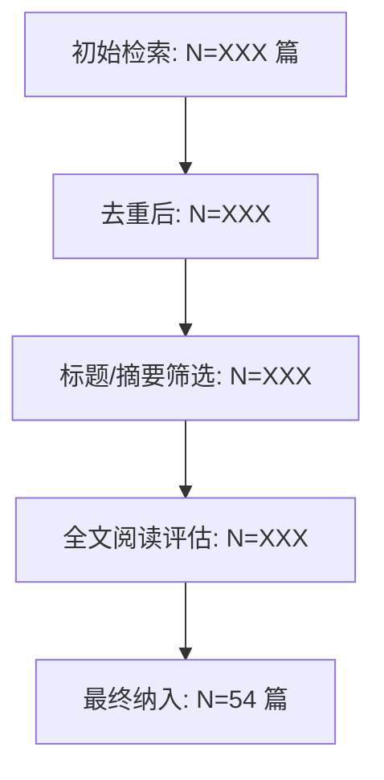

# 综述论文优化完善方案

> **状态**: ✅ 已关闭 — 全部 15 项于 2026-07-14 执行完成
> **结果**: v3.1.0 → v4.0.0-dev，P0–P2 验收通过

---

> **基于审计报告**: `docs/综述文档引用审计报告.md`（2026-07-14）
> **目标文档**: `docs/AI与大模型在知识领域、Agent记忆、推理数据及推理关系中的前沿研究综述.md`
> **当前版本**: v3.1.0 → **目标版本**: v4.0.0

---

## 一、前置决策：文档定位

在开始修订前，需先确认本文档的**最终定位**，这直接影响后续所有修订的范围和深度。

| 选项 | 说明 | 适用场景 |
|------|------|---------|
| **A：内部知识库笔记** | 保留现有 `tree: 文献审计` 内部标签体系，仅修复引用元数据缺陷和事实性错误 | 团队内部知识管理、个人研究笔记 |
| **B：公开发表综述** | 全面学术化改造，移除内部标记，补齐方法论、批判分析等缺失要素 | 投向 arXiv / 中文期刊 / 会议 Workshop |

**本方案默认按选项 B（公开发表综述）设计**。若最终选择 A，只需执行 P0-3（引用修复）和 P1-5（ref [10] 修正），其余可跳过。

---

## 二、修订清单总览

```
P0（阻塞发布）────────────────────────────────
  P0-1  添加作者信息与论文元数据
  P0-2  新增"综述方法论"章节
  P0-3  移除/转化内部引用标记

P1（影响学术质量）─────────────────────────────
  P1-1  补全 5 篇引用的缺失元数据
  P1-2  新增"相关综述对比"小节
  P1-3  各章增加"批判性比较"段落
  P1-4  修正 [10] 引用语境偏差

P2（提升论文品质）─────────────────────────────
  P2-1  补充 Scheherazade 引用
  P2-2  扩展第 6.1 节 RLVR 讨论
  P2-3  细化结论与未来方向
  P2-4  新增领域分类图和方法对比图
  P2-5  第 5.1 节标题与内容对齐
```

---

## 三、逐项执行方案

---

### P0-1：添加作者信息与论文元数据

**当前状态**：frontmatter 中有 `forest`/`tree`/`branch` 内部标记，无作者字段。

**修改操作**：

**操作 A — 修改 YAML frontmatter**（精确替换）：

定位到文件的 `---` 包围的元数据块（第 1-26 行），需要：

1. **新增字段**：
```yaml
authors:
  - name: <作者姓名>
    affiliation: <机构全称>
    email: <通讯邮箱>
    orcid: <ORCID（可选）>
abstract: |
  近年来，大型语言模型（LLM）的推理能力取得了显著突破...
  （从引言提取 150-250 字精炼摘要）
```

2. **移除内部标记**（见 P0-3）：
   - 删除 `forest: bim`
   - 删除 `tree: 文献审计`
   - 删除 `branch: 综述文献`
   - 将 `refs` 中的 `[mke]`/`[bim]` 条目移至文末注释或直接删除

3. **更新 `updated` 日期**为修订完成日期，`version` 改为 `4.0.0`。

**验证标准**：
- [ ] 作者姓名字段非空
- [ ] 机构名称为正式全称（非缩写）
- [ ] `abstract` 字段存在且字数 150-250
- [ ] frontmatter 中不再出现 `forest`/`tree`/`branch` 内部字段

---

### P0-2：新增"综述方法论"章节

**插入位置**：在"第一章 引言"末尾、"第二章 知识领域"之前，新增一节。

**章节结构与内容模板**：

```markdown
## 一.X 综述方法论

### 1.X.1 文献检索策略

本综述的文献检索遵循 PRISMA 2020 指南 [PRISMA-ref]，具体检索策略如下：

| 维度 | 配置 |
|------|------|
| 数据库 | arXiv、DBLP、Google Scholar、Semantic Scholar |
| 时间范围 | 2023 年 1 月 — 2026 年 7 月 |
| 语言 | 英文（为主）+ 中文 |
| 搜索关键词 | 见下表 |

**关键词组合**（分主题）：

| 主题 | 关键词 |
|------|--------|
| 知识图谱增强推理 | `knowledge graph` + `LLM reasoning`, `GraphRAG`, `KGQA`, `multi-hop reasoning` |
| Agent 记忆 | `agent memory`, `LLM memory`, `long-term memory agent`, `memory-augmented LLM` |
| 事实核查与知识质量 | `fact checking` + `LLM`, `knowledge conflict`, `hallucination detection` |
| 推理评估 | `reasoning benchmark`, `LLM evaluation`, `agent benchmark` |
| 持续学习与知识编辑 | `knowledge editing`, `continual learning` + `LLM`, `catastrophic forgetting` |
| 多模态推理 | `multimodal reasoning`, `visual reasoning` + `LLM` |

### 1.X.2 筛选流程



**纳入标准**：
1. 发表于 2023 年 1 月至 2026 年 7 月
2. 经同行评审的会议/期刊论文，或已发布于 arXiv 的预印本（高引用量优先）
3. 主题属于六大覆盖方向之一
4. 提供可验证的方法描述或实验数据

**排除标准**：
1. 纯商业产品文档或博客文章（无学术同行评审）
2. 仅涉及传统 KG 嵌入或传统 NLP 任务、与 LLM 推理无关的工作
3. 非英文/非中文论文

### 1.X.3 覆盖面与局限性

本综述的局限性包括：
- 以 arXiv 预印本为主要来源，部分论文尚未完成同行评审
- 六大方向深度不均，Agent 记忆和知识编辑方向文献更集中
- 受篇幅限制，每个子方向仅选取代表性工作，未穷举
```

**验证标准**：
- [ ] 搜索策略中至少列出 4 个关键词组合
- [ ] 筛选流程图存在（文字描述或 mermaid 图均可）
- [ ] 纳入/排除标准各 ≥ 3 条
- [ ] 局限性自述 ≥ 2 条
- [ ] 新增的 PRISMA 参考文献被加入参考文献列表

---

### P0-3：移除/转化内部引用标记

**当前状态**：frontmatter 中有 4 个 `[mke]`/`[bim]` 标签，正文中未使用这些标签（正文只用 `[1]`-`[54]` 编号引用），仅在 frontmatter 的 `refs` 字段出现。

**修改操作**（按优先级排序）：

**操作 A — 删除 frontmatter 中的内部标记字段**：

```diff
- forest: bim
- tree: 文献审计
- branch: 综述文献
```

**操作 B — 转化 `refs` 中的内部标签**：

`refs` 中的 4 条记录：
```yaml
refs:
  - "[mke] 知识领域森林理论 | 知识图谱与森林层级的结构对应"
  - "[mke] 渐进式检索引擎 | GraphRAG 多跳推理的工程对应"
  - "[bim] 键值记忆框架 | Agent 记忆载体形式的三分类"
  - "[bim] 记忆再巩固与遗忘机制 | 知识编辑与持续学习的生物启发"
```

替换为文末注释节：
```markdown
## 致谢与说明

本文的理论框架受到以下内部研究的启发，但正文论述均基于公开发表论文：
- 知识领域森林理论（知识图谱与森林层级的结构对应）
- 渐进式检索引擎（GraphRAG 多跳推理的工程对应）
- 键值记忆框架（Agent 记忆载体形式的三分类）
- 记忆再巩固与遗忘机制（知识编辑与持续学习的生物启发）
```

或更简洁地直接删除 `refs` 字段（如果这些标记并非论文论证的必要支撑）。

**验证标准**：
- [ ] `grep "forest:"` 在论文中无结果
- [ ] `grep "tree:"` 在论文中无结果
- [ ] `grep "branch:"` 在论文中无结果
- [ ] `grep "\[mke\]"` 在论文中无结果（或仅在"致谢与说明"节出现）
- [ ] `grep "\[bim\]"` 在论文中无结果（或仅在"致谢与说明"节出现）

---

### P1-1：补全 5 篇引用的缺失元数据

**逐条修复方案**：

| 引用编号 | 当前状态 | 修复操作 |
|---------|---------|---------|
| **[16]** | 无 arXiv ID，标题不匹配 | 替换为：`[16] <作者列表>. Memory in the Age of AI Agents: A Survey. *arXiv:2512.13564*, 2025.`（需查出确切作者） |
| **[25]** | 无作者 | 补充：`Su, Z., Zhang, J., et al. ConflictBank: A Benchmark for Evaluating the Influence of Knowledge Conflicts in LLMs. *arXiv:2408.12076*, 2024. (NeurIPS 2024 Datasets & Benchmarks)` |
| **[31]** | 无作者 | 通过 `arxiv:2603.09117` 查出作者，补充完整条目 |
| **[51]** | 无作者 | 补充：`Hu, Y., Wang, Y., & McAuley, J. MemoryAgentBench: Evaluating Memory in LLM Agents via Incremental Multi-Turn Interactions. *arXiv:2507.05257*, 2025.` |
| **[16a]** | 作者顺序可疑 | 核对 `arxiv:2504.19413` 原始论文，确认作者顺序后修正 |

**执行方式**（推荐）：用 arxiv API 或手动访问每篇论文的 arXiv 页面，复制准确作者列表。

**验证标准**：
- [ ] 5 篇引用均有完整作者列表
- [ ] [16] 标题与 arXiv:2512.13564 一致
- [ ] [25] 标注 NeurIPS 2024 发表信息
- [ ] [16a] 作者顺序与 arXiv 原文一致

---

### P1-2：新增"相关综述对比"小节

**插入位置**：在第一章（引言）末尾，紧接 P0-2 的方法论章节之后。

**内容模板**：

```markdown
## 一.Y 相关综述比较

本综述与近年来相关综述的定位对比如下：

| 综述 | 覆盖方向 | 时间截止 | 本文差异 |
|------|---------|---------|---------|
| Wu et al. (2024) [39] | 持续学习 × LLM | 2024.01 | 本文扩展至知识编辑、EWC on KG，且覆盖到 2026.07 |
| Memory in the Age of AI Agents [16] | Agent 记忆 | 2025.12 | 本文从 Agent 记忆延伸至 KG 推理、事实核查、多模态推理的交叉地带 |
| ...（需补充 1-2 篇 KG+LLM 综述） | | | |

本综述的**独特贡献**在于：
1. 将 KG 增强推理、Agent 记忆、事实核查、持续学习等通常独立讨论的领域**交叉整合**，揭示其内在关联
2. 覆盖时间更新至 2026 年 7 月，纳入了 CS-RAG、DYNA、逻辑规则知识编辑等最新工作
3. 从"知识可追溯性"和"输出可靠性"的双重视角组织材料，而非简单的技术分类罗列
```

**前置任务**：需要额外检索 1-2 篇 KG+LLM 综述（如 "A Survey on Knowledge Graphs for Large Language Models" 等）。

**验证标准**：
- [ ] 对比表包含 ≥ 3 篇已有综述
- [ ] "独特贡献"列出 ≥ 2 条本文区别于已有综述的具体维度
- [ ] 每条差异描述可被正文内容验证（不夸大）

---

### P1-3：各章增加"批判性比较"段落

**目标**：在第 2-7 章每个主题域末尾，增加一段批判性分析。

**模板**（以第 2 章 GraphRAG 为例）：

```markdown
### 2.X 方法比较与讨论

下表对本节讨论的主要方法进行横向对比：

| 方法 | 推理范式 | 依赖 KG 完整性？ | 是否需要训练？ | 可解释性 | 主要局限 |
|------|---------|-----------------|---------------|---------|---------|
| ToG [3] | LLM⊗KG 交互探索 | 是 | 否 | 高（每步可追溯三元组） | 搜索效率受 KG 规模限制 |
| PoG [2] | 多跳路径融合 | 是 | 否 | 中 | 路径质量依赖预提取 |
| SoG [14] | observe-think-navigate | 是 | 否 | 高 | 对 LLM 推理能力要求高 |
| KG-RAR [1] | 过程导向分层检索 | 是 | 部分（PRP-RM） | 中 | 需要构建过程 KG |
| CS-RAG [8] | 约束规划+充分性检查 | 否（设计为鲁棒） | 否 | 中 | 规划开销可能较大 |

**关键观察**：
1. 大部分方法假设 KG 是完整的，但 CS-RAG [8] 独树一帜地处理不完美 KG——这两类工作在部署场景下的实用性差异值得关注
2. "无需训练"是当前主流趋势（ToG/PoG/SoG 均为零样本），但 KG-RAR [1] 的 PRP-RM 表明轻量微调可能带来显著收益
3. 目前缺少在相同 KGQA 基准（如 GrailQA、WebQSP）上的标准化对比实验，各论文报告的数字不可直接横向比较
```

**需增加的批判性比较段落**（6 处）：

| 位置 | 内容 | 建议行数 |
|------|------|---------|
| 第 2 章末 | GraphRAG 方法横向对比 | 15-25 行 |
| 第 3 章末 | Agent 记忆框架对比（Mem0/MemVerse/DYNA） | 10-20 行 |
| 第 4 章末 | 事实核查方法对比 | 10-20 行 |
| 第 5 章末 | 推理基准演变分析 | 8-12 行 |
| 第 6 章末 | 多模态推理方法对比 | 8-15 行 |
| 第 7 章末 | 持续学习 vs 知识编辑对比 | 10-20 行 |

**验证标准**：
- [ ] 第 2-7 章每个主题域末尾有"比较与讨论"或"批判性分析"段落
- [ ] 每处 ≥ 8 行实质性分析（非模板凑数）
- [ ] 至少 3 处包含横向对比表格
- [ ] 每处至少提出 1 个开放问题或已知局限

---

### P1-4：修正 [10] 引用语境偏差

**当前状态**：第 2.2 节第 105 行：

> 一些工作探索将 LLM 作为"知识引擎"，通过提示工程让模型直接生成 KG 或推理路径 [10]。

**问题**：[10]（Ohmae & Ohmae, "The Brain versus AI"）是脑-AI 电路计算对比论文，不涉及 LLM 作为 KG 生成器的工程应用。

**修复方案 A（推荐）**：替换为更恰当的引用。

需要检索以下方向的近期工作替代 [10]：
- LLM 自动构建知识图谱（如 "AutoKG"、"LLM for KG construction"）
- 神经-符号推理（如 "Neuro-Symbolic Reasoning with LLMs"）

建议候选引用：
- 搜索 `LLM knowledge graph construction prompting` 在 arXiv 2024-2025 的论文
- 或直接删除 [10] 并扩展 [4] 或 [6] 的 KG 构建部分讨论

**修复方案 B**：重新描述 [10] 的关联角度：

```diff
- 一些工作探索将 LLM 作为"知识引擎"，通过提示工程让模型直接生成 KG 或推理路径 [10]。
+ 另有研究从计算神经科学视角比较脑皮层回路与 AI 系统中的通用电路计算原理，为理解 KG 与世界模型的表征关系提供了跨学科视角 [10]。
```

**验证标准**：
- [ ] [10] 的上下文描述与论文实际主题一致
- [ ] 若替换引用，新引用可在 arXiv 上验证存在
- [ ] 若保留 [10]，段的描述不包含"KG 生成"或"推理路径工程化"等 misleading 措辞

---

### P2-1：补充 Scheherazade 引用

**当前状态**：第 5.2 节第 237 行：

> **Scheherazade** 技术能够评估模型在处理长链条件推理时的表现。

需要检索该技术的原始论文并添加引用。

**搜索策略**：
- `Scheherazade long chain reasoning benchmark LLM`
- 可能的来源：arXiv、ACL/EMNLP/NeurIPS proceedings

**验证标准**：
- [ ] Scheherazade 在参考文献列表中有完整条目
- [ ] 正文引用编号与参考文献一致

---

### P2-2：扩展第 6.1 节 RLVR 讨论

**当前状态**：第 6.1 节只讨论了 DeepSeek R1 [46] 和 DCPO [31]，缺少 RLVR 全景。

**需补充内容**：

```markdown
### 6.1 推理深度、模型规模与 RLVR 训练（扩展）

#### 6.1.1 RLVR 的核心机制

RLVR（Reinforcement Learning from Verifiable Rewards）的核心思想是：使用可自动验证的奖励信号（如数学题答案、代码执行结果）训练 LLM 生成更有效的推理步骤。

**代表性 RLVR 方法**：

| 方法 | 训练策略 | 奖励设计 | 代表模型 |
|------|---------|---------|---------|
| GRPO [GRPO-ref] | 组内相对策略优化 | 基于规则的验证 + 格式奖励 | DeepSeek-R1 [46] |
| PPO-based RLVR | 标准 PPO + 可验证奖励 | 答案正确性二值奖励 | OpenAI o1 [47] |
| DCPO [31] | 解耦推理与校准 | 分离推理正确性和置信度奖励 | — |

#### 6.1.2 规模效应与蒸馏

...（现有内容调整）

#### 6.1.3 已知挑战：Reward Hacking 与校准退化

RLVR 面临的主要挑战包括：
- **Reward Hacking**：模型可能学会利用奖励函数的漏洞而非真正提升推理能力
- **校准退化**：即使答案错误也给出极高置信度 [31]
- **推理链的格式崩溃**：长期 RLVR 训练可能导致推理格式退化
```

**前置任务**：检索 GRPO 原始论文（DeepSeekMath 或 DeepSeek-R1 中描述了 GRPO）作为新增引用。

**验证标准**：
- [ ] 第 6.1 节新增 ≥ 1 个引用（GRPO 或 reward hacking 相关）
- [ ] RLVR 方法对比表存在
- [ ] "已知挑战"段落 ≥ 3 条

---

### P2-3：细化结论与未来方向

**当前状态**：第 8 章"未来方向"五个条目为高层次方向，结尾模板化。

**修改方案**：

```markdown
## 八、结论与展望

### 8.1 当前进展总结

（保留现有表格）

### 8.2 开放挑战与可操作研究问题

1. **神经-符号深度融合**
   - **当前瓶颈**：ToG 等方法的搜索效率随 KG 规模线性下降，10^6 节点级 KG 上单次查询延迟超过 30 秒
   - **待解决问题**：(a) 如何在不牺牲可解释性的前提下对符号推理进行神经近似加速？(b) 什么粒度的符号知识对 LLM 推理收益最大？

2. **可信推理与知识溯源**
   - **当前瓶颈**：FEVER 基准上最先进的事实核查 F1 约为 0.93 [28]，但跨领域泛化时下降至 0.78-0.85
   - **待解决问题**：(a) 如何设计统一的事实一致性评估框架覆盖声明、数值、时态三类事实？(b) 人在回路中的验证成本如何从"每条路径审核"降低到"异常检测+抽样审核"？

3. **持续学习与记忆演进**
   - **当前瓶颈**：EWC 降低了 45.7% 的遗忘 [33]，但任务数量增加时遗忘率回升
   - **待解决问题**：(a) 贝叶斯框架 [35] 是否能从理论上扩展至多模态场景？(b) 记忆再巩固的生物机制（突触标签假说）能否为 KG 嵌入更新提供新思路？

4. **知识编辑的规模化与可靠性**
   - **当前瓶颈**：单事实编辑与蕴含知识评估之间的性能差距高达 24% [45]
   - **待解决问题**：(a) 顺序编辑的累积毒性如何定量建模和预测？(b) 编辑后模型在不同下游任务上的性能退化如何检测？

5. **多模态与多智能体推理**
   - **当前瓶颈**：MLLM 在 3D 空间操作任务上接近随机猜测 [54]
   - **待解决问题**：(a) 视觉推理链的自动验证机制如何设计？(b) 多智能体协作中的角色分工是否应该动态调整？

### 8.3 结语

（避免模板化 AGI 宣言，改为对领域发展的具体预判）
```

**验证标准**：
- [ ] 每个未来方向包含 ≥ 1 个定量化"当前瓶颈"描述
- [ ] 每个未来方向包含 ≥ 1 个具体研究问题
- [ ] 结语不包含"迈向 AGI"等空泛表述

---

### P2-4：新增领域分类图和方法对比图

**推荐新增图**（优先级排序）：

| 序号 | 图类型 | 位置 | 描述 | 建议工具 |
|------|--------|------|------|---------|
| 图 1 | 领域全景图 | 第一章引言 | 六大方向的分类与交叉关系图 | draw.io / mermaid |
| 图 2 | 时间线图 | 第一章方法论 | 各子领域关键论文的时间分布 | Python matplotlib / ECharts |
| 图 3 | GraphRAG 方法对比 | 第二章末尾 | ToG/PoG/SoG/KG-RAR 的架构流程对比 | draw.io |
| 图 4 | Agent 记忆架构对比 | 第三章末尾 | Mem0/MemVerse/DYNA 的记忆组织方式对比 | draw.io |
| 图 5 | PRISMA 流程图 | 第一章方法论 | 文献筛选流程 | mermaid / PRISMA 官方模板 |

**验证标准**：
- [ ] 论文包含 ≥ 3 张图
- [ ] 每张图有编号和标题（"图 X：..."格式）
- [ ] 每张图在正文中有引用（"如图 X 所示..."）

---

### P2-5：第 5.1 节标题与内容对齐

**当前状态**：第 5 章标题为"推理数据与评估"，但"前沿"基准表格中全部为 Agent 记忆基准。

**修复方案**：在第 5.1 节开头或表格前添加范围说明：

```diff
+ > 注：本节聚焦于 Agent 推理能力评估基准。关于通用 LLM 推理基准（如 Big-Bench、MMLU-Pro 等），
+ > 参见相关综述 [citation]。Agent 记忆专项基准因与本文第 3 章紧密关联而在此单独讨论。
```

或调整标题：`### 5.1 推理基准的演进：从数学推理到 Agent 记忆评估`

**验证标准**：
- [ ] 第 5.1 节开头或标题有明确的"聚焦 Agent 记忆评估"范围声明
- [ ] 或表格中补充 1-2 个通用推理基准（如 MMLU-Pro、Big-Bench Hard）

---

## 四、实施路线图

```
Week 1                     Week 2                     Week 3
│                          │                          │
├─ P0-1 作者元数据（1h）     ├─ P1-3A 第2章批判比较（2d）  ├─ P2-4 制图（2d）
├─ P0-2 方法论章节（2d）     ├─ P1-3B 第3章批判比较（1d）  ├─ P2-2 RLVR扩展（0.5d）
├─ P0-3 内部标记清理（1d）   ├─ P1-3C 第4章批判比较（1d）  ├─ P2-5 标题对齐（0.5h）
├─ P1-1 引用元数据（0.5d）   ├─ P1-3D 第5-7章批判比较（1d）├─ P2-3 结论细化（1d）
├─ P1-2 综述对比（1d）      │                          ├─ P2-1 Scheherazade（0.5h）
├─ P1-4 [10]修正（1h）      │                          ├─ 全文通读润色（1d）
│                          │                          │
└─ Milestone: P0+P1-1/2/4  └─ Milestone: 批判分析完成   └─ Milestone: v4.0 发布
   完成，论文可初步提交         论文质量大幅提升              最终检查和发布
```

---

## 五、验证清单（总表）

在 v4.0 发布前，逐项核对：

**P0 阻塞项**
- [ ] P0-1：frontmatter 有 author 字段（含姓名+机构+邮箱），abstract 存在且 150-250 字
- [ ] P0-2：第一章末尾有"综述方法论"章节，含搜索策略表+筛选流程图+纳入/排除标准+局限性
- [ ] P0-3：全文无 `forest:`/`tree:`/`branch:` 字段，无 `[mke]`/`[bim]` 行内标记

**P1 质量项**
- [ ] P1-1：[16][25][31][51] 有完整作者列表，[16] 标题与 arXiv 一致
- [ ] P1-2：第一章有"相关综述比较"小节，含对比表（≥3 篇）
- [ ] P1-3：第 2-7 章每章末尾有批判性比较段落（≥8 行/处，≥3 处含表格）
- [ ] P1-4：[10] 的上下文描述与论文实际主题一致

**P2 提升项**
- [ ] P2-1：Scheherazade 有引用条目
- [ ] P2-2：第 6.1 节有 RLVR 方法对比表 + 挑战段（≥3 条）
- [ ] P2-3：每个未来方向含定量瓶颈 + 具体研究问题，无模板化 AGI 结尾
- [ ] P2-4：论文含 ≥3 张图，各有编号和正文引用
- [ ] P2-5：第 5.1 节有范围说明或补充了通用推理基准

**最终检查**
- [ ] 全文 `grep` 无内部标记残留
- [ ] 所有 `[N]` 引用在参考文献列表中有对应条目
- [ ] 所有参考文献条目在正文中有至少一处引用
- [ ] 版本号 `version: 4.0.0`，日期 `updated` 已更新
