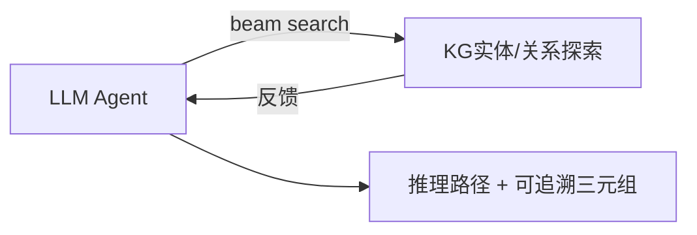

# Think-on-Graph (ToG) 交互式推理范式

## 核心范式

**Think-on-Graph (ToG)** 提出 "LLM⊗KG" 的深度整合范式 [3]：将LLM作为Agent在KG上交互式探索相关实体和关系，执行 **beam search** 发现最有前景的推理路径。

## 工作流程

## 核心贡献：知识可追溯性 (Knowledge Traceability)

ToG最关键的贡献是证明了**知识可追溯性**：

> 推理路径中的每一步都可以追溯到KG中的具体事实三元组。人类专家可以检查推理链中的每一步并提供反馈来纠正错误推理，实现"人在回路中"的可信推理。

## 关键特性

| 特性 | 说明 |
|------|------|
| 推理范式 | LLM作为Agent × KG交互探索 |
| 搜索策略 | Beam search |
| 可追溯性 | 每步可回溯至KG三元组 |
| 人在回路 | 人类专家可检查并纠正每一步 |

## 主要局限

搜索效率受KG规模线性影响：在10^6节点级KG上，单次查询延迟可能超过30秒，限制了实时应用场景。
